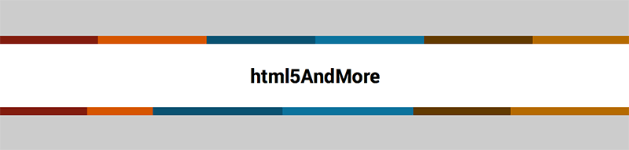

Background a Strisce con SASS
==

Il codice presente in questo repo rappresenta il codice di esempio per l'omonimo articolo apparso su [html5AndMore](http://html5andmore.info/backgound-strisce-sass/).

All'interno dell'articolo andiamo a conoscere diverse funzionalità di [SASS](http://sass-lang.com/) e [Compass](http://compass-style.org/) come le strutture `@if/@else`, i cicli `@for` e altri calcoli interessanti che si possono fare con questi elementi.



Nella lezione ti mostro come sia possibile creare un unico mixin che ci permetterà di creare questi effetti con una singola riga di codice.

Codice d'Esempio
__

Codice SASS:
```.test{
  $colori: ( #801C12 15%, #D35400 25%, #115370 45%, #18749C 65%, #613904 80%, #B36907 100% );
  @include strisce( $colori, to right);
}```

Codice CSS:
```.test {
  background-image: url('data:image/svg+xml;base64,PD94bWwgdmVyc2lvbj0iMS4wIiBlbmNvZGluZz0idXRmLTgiPz4gPHN2ZyB2ZXJzaW9uPSIxLjEiIHhtbG5zPSJodHRwOi8vd3d3LnczLm9yZy8yMDAwL3N2ZyI+PGRlZnM+PGxpbmVhckdyYWRpZW50IGlkPSJncmFkIiBncmFkaWVudFVuaXRzPSJvYmplY3RCb3VuZGluZ0JveCIgeDE9IjAuMCIgeTE9IjAuNSIgeDI9IjEuMCIgeTI9IjAuNSI+PHN0b3Agb2Zmc2V0PSIxNSUiIHN0b3AtY29sb3I9IiM4MDFjMTIiLz48c3RvcCBvZmZzZXQ9IjE1JSIgc3RvcC1jb2xvcj0iI2QzNTQwMCIvPjxzdG9wIG9mZnNldD0iMjUlIiBzdG9wLWNvbG9yPSIjZDM1NDAwIi8+PHN0b3Agb2Zmc2V0PSIyNSUiIHN0b3AtY29sb3I9IiMxMTUzNzAiLz48c3RvcCBvZmZzZXQ9IjQ1JSIgc3RvcC1jb2xvcj0iIzExNTM3MCIvPjxzdG9wIG9mZnNldD0iNDUlIiBzdG9wLWNvbG9yPSIjMTg3NDljIi8+PHN0b3Agb2Zmc2V0PSI2NSUiIHN0b3AtY29sb3I9IiMxODc0OWMiLz48c3RvcCBvZmZzZXQ9IjY1JSIgc3RvcC1jb2xvcj0iIzYxMzkwNCIvPjxzdG9wIG9mZnNldD0iODAlIiBzdG9wLWNvbG9yPSIjNjEzOTA0Ii8+PHN0b3Agb2Zmc2V0PSI4MCUiIHN0b3AtY29sb3I9IiNiMzY5MDciLz48c3RvcCBvZmZzZXQ9IjEwMCUiIHN0b3AtY29sb3I9IiNiMzY5MDciLz48L2xpbmVhckdyYWRpZW50PjwvZGVmcz48cmVjdCB4PSIwIiB5PSIwIiB3aWR0aD0iMTAwJSIgaGVpZ2h0PSIxMDAlIiBmaWxsPSJ1cmwoI2dyYWQpIiAvPjwvc3ZnPiA=');
  background-size: 100%;
  background-image: -webkit-gradient(linear, 0% 50%, 100% 50%, color-stop(15%, #801c12), color-stop(15%, #d35400), color-stop(25%, #d35400), color-stop(25%, #115370), color-stop(45%, #115370), color-stop(45%, #18749c), color-stop(65%, #18749c), color-stop(65%, #613904), color-stop(80%, #613904), color-stop(80%, #b36907), color-stop(100%, #b36907));
  background-image: -webkit-linear-gradient(left, #801c12 15%, #d35400 15%, #d35400 25%, #115370 25%, #115370 45%, #18749c 45%, #18749c 65%, #613904 65%, #613904 80%, #b36907 80%, #b36907 100%);
  background-image: linear-gradient(
    to right,
    #801c12 15%,
    #d35400 15%,
    #d35400 25%,
    #115370 25%,
    #115370 45%,
    #18749c 45%,
    #18749c 65%,
    #613904 65%,
    #613904 80%,
    #b36907 80%,
    #b36907 100%
  );
}```
